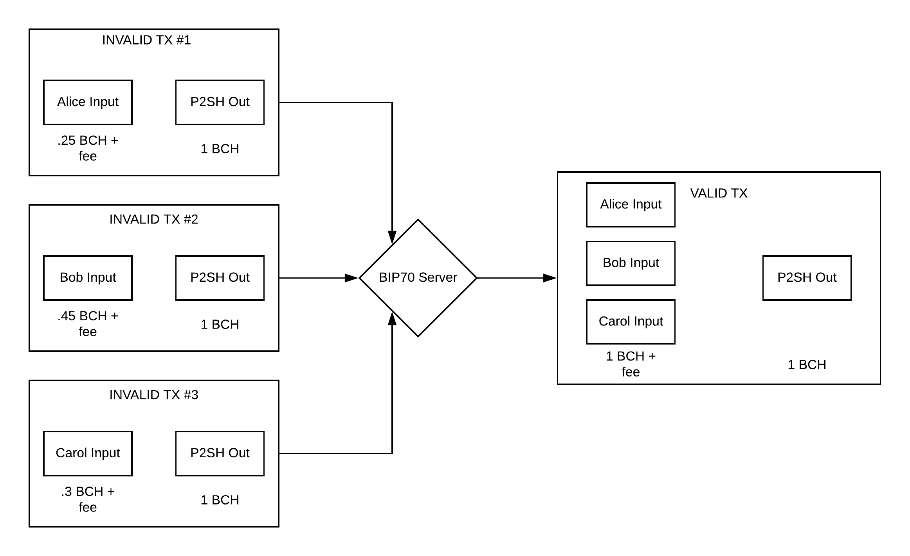

# Multi-Party Merge Transactions

#### Version: 0.1
#### Date published: September 30, 2019

## Purpose

This specification describes an extension to the Bitcoin Payment Protocol (BIP70) which leverages the SIGHASH_ANYONECANPAY signature hash flag to combine two or more partial transactions, from separate parties, into a single transaction. This protocol is useful for "blind" funding of complex script contracts by multiple parties.

## Specification

### Extending Existing Payment Protocol

This payment protocol is an extension of [BIP 70](https://github.com/bitcoin/bips/blob/master/bip-0070.mediawiki) and the [Simple Ledger Protocol URI Scheme Specification](https://github.com/simpleledger/slp-specifications/blob/token-documents/slp-uri-scheme.md). Applications which support these protocols are able, with minor modifications, to support the payment protocol described in this specification.

### Multi-Party Transactions

There is a challenge to funding script contracts that have multiple parties (such as escrow scripts) in a trustless manner. Although each party can broadcast a separate transaction to fund the contract, generally represented as a Pay-To-Script-Hash (P2SH) address, this scenario greatly increases the chance that one or more parties will not transmit their transaction. In such a scenario, all parties would still be able to collect the escrow, should the terms be met in their favor, including a party who did not contribute to funding the escrow. By using an extended version of BIP70, a party in the transaction or a third party (such as an "escrow agent") can collect partial, invalid transactions (*"fragments"*) from each party and merge them together into a single valid transaction with multiple inputs.

#### Invalid Transaction Fragments

Each party will contribute a fragment of the final merged transaction. Each fragment, by itself, will be an invalid transaction, where the total input amount is less than the total output amount. This prevents any party from submitting the fragment of another party. Contracts can be funded in a "blind" manner, without a need for any particular coordination of inputs between parties.

#### JSON Merchant Data

Payment Requests for transactions in this specification will use the [JSON Merchant Data](https://github.com/jeton-tech/payment-protocol-extensions/blob/master/json-merchant-data.md) specification and will have the following properties present in the object:

* ``exact_amount`` - The exact amount, in satoshis, that this party will contribute to the overall input total
* ``anyonecanpay`` - True
* ``contract`` (if contract is present) - Object (or array of objects) representing terms of the script contract(s) such that the P2SH address can be independently validated by the party's wallet. This data should be saved by the wallet to allow recreation of the subscript necessary to spend the contract.

#### Fees

Each fragment is responsible for including a sufficient fee to cover the minimum mining fee that would be necessary for the fragment to be mined into the next block if it were a valid transaction. For instance, if the ``exact_amount`` value is 15000 satoshis, total size of the fragment is 190 bytes, and the minimum mining fee is 1 satoshi/byte, then the total of the inputs in the fragment should be equal to (or slightly greater than) 15190 satoshis.

This ensures that the merged transaction will have sufficient mining fees.

#### Precise Outputs

Because this protocol allows for completely blind contract funding and parties are permitted to sign all outputs with ``SIGHASH_ALL``, all fragments must contain exactly the same outputs in the exact same order to ensure all fragments can be merged into a single transaction. This necessarily means **additional change outputs are not permitted** to be added to fragments. Any fragments with additional outputs or outputs in an order other than that specified in the Payment Request will be rejected.

In order to facilitate precise outputs, it is likely that a given party's wallet will need to create an unspent transaction output (UTXO) for use in the fragment. The easiest means of doing this is to spend the amount that will be needed for the fragment into a UTXO at the same address (with change at a change address), broadcasting that transaction to the blockchain, and then using that resulting UTXO as the input for the fragment.

#### Contract Output

If there are script contracts specified by the ``contract`` property of JSON Merchant Data, the output indexes (of the fragment) associated with those contracts must match the indexes of the contract objects in JSON Merchant Data. In the case of SLP transactions, because the output at index 0 must be the OP_RETURN output, indexes are incremented by one.

* If ``contract`` is an object, then the output of the fragment transaction at index 0 (its P2SH address) will correspond to the contract.
* If ``contract`` is an object, *but the transaction is SLP*, then the output of the fragment transaction at index 1 (its P2SH address) will correspond to the contract.
* If ``contract`` is an array, then the output indexes will correspond to the indexes of the array of contract objects in JSON Merchant Data

This removes confusions and complexity from wallet logic when it is time to spend from the P2SH contract UTXO.
